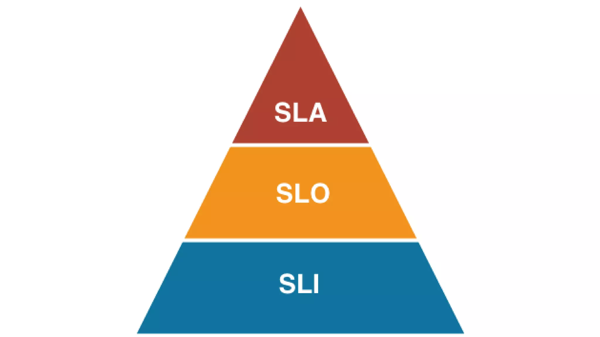
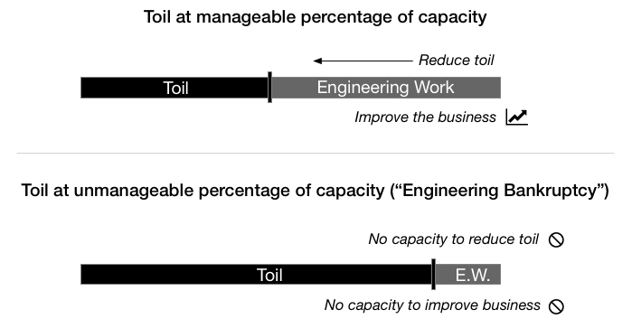
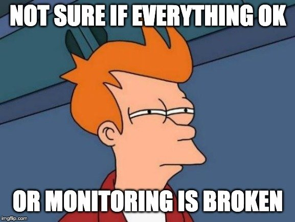

<!-- 
_color: white
_footer: 'https://github.com/Codebytes/sre-devops-platform-eng'
-->

# SRE, DevOps, and Platform Engineering
## Unraveling the Differences

### Chris Ayers

---

## Chris Ayers
### Senior Customer Engineer Microsoft

<i class="fa-brands fa-twitter"></i> Twitter: @Chris\_L\_Ayers
<i class="fa-brands fa-mastodon"></i> Mastodon: @Chrisayers@hachyderm.io
<i class="fa-brands fa-linkedin"></i> LinkedIn: [chris-l-ayers](https://linkedin.com/in/chris-l-ayers/)
<i class="fa fa-window-maximize"></i> Blog: [https://chris-ayers.com/](https://chris-ayers.com/)
<i class="fa-brands fa-github"></i> GitHub: [Codebytes](https://github.com/codebytes)

---

# Agenda

- Common Problems
- Introduction to  Site Reliability Engineering (SRE)
- Dive into DevOps
- Exploring Platform Engineering

---

# Introduction to SRE
> Site Reliability Engineering

---

# **SRE is what happens when you ask a software engineer to design an operations team**
*Benjamin Treynor Sloss*

---

# SRE Responsibilities

- Availability
- Latency
- Performance
- Efficiency

- Change Management
- Monitoring
- Emergency Response
- Capacity Planning

---

# <!-- fit --> Hope is not a strategy.
>Common SRE Saying

---

# SRE: Principles & Practices

---

# Embracing Risk
   - Achieving high reliability is tough.
   - Learn from unexpected failures.
   - Always expect systems to have shortcomings.
   - SRE teams should proactively address risks.
   - Balance the costs and benefits of increased reliability.

---
<!-- _footer: "" -->

---

# Reliability

| Level       | Monthly Downtime | Annual Downtime | Cost  |
| ----------- | ---------------- | --------------- | ----- |
| **99.9%**   | 43.8m            | 8.75h           | $     |
| **99.95%**  | 21.9m            | 4.375h          | $$    |
| **99.99%**  | 4.38m            | 52.6m           | $$$   |
| **99.995%** | 2.19m            | 26.3m           | $$$$  |
| **99.999%** | 26s              | 5.25m           | $$$$$ |

>https://uptime.is/five-nines

---

# Service Level Objectives
| SLI | SLO | SLA |
|---|---|---|
| Service Level Indicator | Service Level Objective | Service Level Agreement |
| Metrics for service quality, e.g., error rate. | Targets, e.g., 99.9% uptime/month. | Contracts with set metrics and penalties. |
| Assess service quality. | Define service quality goals. | Formalize commitments and consequences. |

---

---

# Error Budgets

- A tool to balance reliability and rate of innovation.
- Allows for a predetermined level of acceptable unreliability.

---

<!-- _footer: "" -->

---

# Components of Error Budgets

| Component     | Description                 | Example                                     |
| ------------- | --------------------------- | ------------------------------------------- |
| **Objective** | Desired success level       | 99.95%                                      |
| **SLI**       | Evaluation of failed events | 95th percentile latency < 100ms over 5 mins |
| **Timeframe** | Recency bias for the SLI    | Previous 28 days                            |

---

# Constructing an Error Budget

> "99.95% of the 95th percentile latency of API requests over 5 mins is < 100ms over the previous 28 days."

**Error Budget** = 1 - *Objective*

For our example:

- Objective: 99.95% (or 0.9995)
- Error Budget: 0.05% (or 0.0005)

Over 28 days, this is:

> 20.16 minutes (.0005 * (28 * 24 * 60))

---

# When the Error Budget is Exhausted?

- **Halt**: 
  - No new features or deployments.
  - No changes or experiments.

- **Prioritize**:
  - Enhance reliability.
  - Minimize toil.
  - Bolster monitoring & automation.
  - Strengthen testing.

* **Improve reliability.**
* **Improve reliability.**

---

# Toil
- Manual work needed to maintain a service.
- SREs use automation to minimize toil.

---

# Managing Toil
- Identify time-consuming SRE tasks.
- Distinguish actual toil from manual tasks.
- Set clear guidelines.
- Build features that reduce toil and enhance reliability.

---
# Monitoring Distributed Systems

## Why Monitor?
- Distributed systems span multiple locations, increasing complexity.
- Detect anomalies early to prevent bigger problems.
- Gain insights into system health and pinpoint areas for improvement.

---

# Core Monitoring Types

|                 | **Black-box**       | **White-box**          |
| --------------- | ------------------- | ---------------------- |
| **Focus**       | System Outputs      | System Internals       |
| **Reflection**  | User Experience     | Component Interactions |
| **Data Source** | External Tests      | Internal Metrics/Logs  |
| **Use Case**    | Availability Checks | Debugging & Profiling  |

---

# Effective Alerting
- Alert based on potential user impact.
- Notify when nearing an SLO breach.
- Make alerts clear and directly useful.

---

# Monitoring Distributed Systems
## Best Practices
- **Consistent Metrics**: Adopt uniform metrics throughout components for clarity.
- **Granular Monitoring**: Detailed observation, both system-wide and at the component level.
- **Postmortems**: Utilize monitoring data post-incident to derive insights and prevent recurrences.

---

# Monitoring Distributed Systems
## Visualization & Review
- **Dashboards**: Implement live visualization tools for real-time system status overviews.
- **Feedback Loops**: Continually refine monitoring based on feedback and new challenges.
- **Regular Reviews**: Periodically examine the system's monitoring setup for relevance and efficiency.

---

- **Release Engineering**
   - Ensure safe and efficient software rollouts.

---

## SRE Practices

- **Alerting & On-Call**
   - Effective alert strategies.
   - Best practices for on-call engineers.

---

- **Troubleshooting & Emergency**
   - Techniques for diagnosing issues.
   - Handling system emergencies and outages.

---

- **Incident Management**
   - Best practices from incident response to postmortem.

---

- **Tracking & Testing**
   - Keeping records of outages.
   - Ensuring reliability through rigorous testing.

---

- **Software Engineering in SRE**
   - The intertwined roles of software engineering and SRE.

---

- **Load Balancing & Overload**
   - Distribute traffic effectively and manage system overloads.

---

- **Failures & Critical State**
   - Address cascades and ensure data consistency.

---

- **Data Processing & Product Launches**
   - Manage data flows and ensure successful product rollouts.

---

# Error Budgets

---

## Components of Error Budgets

1. **Objective:** The desired success level, typically a percentage.
    - **Example:** 99.95%
2. **SLI (Service Level Indicator):** An evaluation used to differentiate the number of failed events.
    - **Example:** 95th percentile latency of API requests over 5 mins is < 100ms.
3. **Timeframe:** Introducing a recency bias to the SLI.
    - **Example:** Previous 28 days.

---

## Constructing an SLO

Given the example components, the SLO can be expressed as:

> "99.95% of the 95th percentile latency of API requests over 5 mins is < 100ms over the previous 28 days."

---

## Calculating the Error Budget

The Error Budget is derived from:
> Error Budget = 1 - Objective of the SLO

**Example Calculation:**
(1 - .9995 = .0005) or 0.05%

Given a 28-day timeframe, this translates to an error "budget" of:
> 20.16 minutes (.0005 * (28 * 24 * 60))

---

# Infrastructure as Code (IaC)

Infrastructure as code (IaC) is a way to manage and provision infrastructure resources using configuration files and automation tools. 

---

## IaC in SRE & DevOps: Key Benefits

1. **Automation & Consistency:** IaC automates provisioning, ensuring consistent infrastructure across environments.
2. **Version Control:** Infrastructure, like software code, can be versioned, allowing for easy rollbacks and history tracking.

---

## IaC in SRE & DevOps: Scalability & Collaboration

1. **Scalability:** With IaC, scaling infrastructure is as simple as adjusting parameters, facilitating easy growth.
2. **Collaboration:** Teams can review infrastructure changes like software code, fostering collaboration and preventing errors.

In SRE and DevOps, the drive is to minimize manual work and increase repeatability and reliability. IaC stands as a foundational component for these goals.

---

## Monitoring & Automation in SRE

- Techniques for effective **monitoring** of distributed systems.
- The importance of **automation** in operations.

---

## Release & Simplicity in SRE

- Ensuring safe and efficient **software releases**.
- Importance of keeping systems **simple** and manageable.

---

## Management in SRE

- Training and **onboarding** SREs.
- **Communication** and collaboration in SRE.
- Adapting and evolving **SRE practices**.

---

## Conclusions

- Insights from other sectors.
- Final thoughts and takeaways on SRE.

---

# Dive into DevOps

---

DevOps promotes collaboration between development and operations teams through a set of practices and cultural philosophies.

---

 
 

# “DevOps is the union of people, process, and products to enable continuous delivery of value to our end users.”

## - Donovan Brown

 
 

---

## Key Concepts of DevOps

- **CI/CD:** Automatic build, test, and deploy processes.

---

- **Infrastructure as Code:** Automation of infrastructure tasks.

---

- **Feedback Loops:** Quick detection and resolution of issues.

---

- **Collaborative Culture:** Breaking silos and shared responsibilities.

---

# Exploring Platform Engineering

Platform Engineering is the nexus of software development, infrastructure management, and best practices, centered on providing robust, scalable, and efficient platforms for applications and services.

---

## Defining Platform Engineering

Platform Engineering facilitates:
- Streamlined software deployments
- Infrastructure scalability
- Seamless integration between tools and services
- Accelerated development processes

It's about laying the foundation upon which applications thrive.

---

## Key Concepts of Platform Engineering

---

### Self-service Platforms

Empowering developers with:
- Automated deployment pipelines
- Infrastructure provisioning with a click
- Monitoring and logging integrations

The aim? Minimize manual intervention and speed up the development lifecycle.

---

### Abstract Complexity

What does this mean?
- Hide intricate infrastructure details from developers.
- Provide standardized templates for deployment.
- Ensure developers focus on code, not infra setup.

Simplified processes, maximized efficiency.

---

### Microservices & Containers

Why are they crucial?
- **Flexibility:** Break applications into smaller, manageable units.
- **Scalability:** Scale components independently as needed.
- **Portability:** Containers ensure consistent environments across stages.

Tools like Kubernetes orchestrate these containers, ensuring reliability and scalability.

---

### Scaling & Performance

As demand grows:
- Dynamically allocate resources.
- Load balance to distribute traffic.
- Monitor in real-time for performance insights.

Optimizing resources ensures the system remains responsive even under peak loads.

---

## Why is Platform Engineering Vital?

1. **Developer Experience**
1. **Accelerated Development:** Less time grappling with infrastructure means more time coding.
1. **Consistency:** Same tools, processes, and environments across teams.
1. **Reliability:** Best practices ensure high availability and minimal downtime.
1. **Future-proofing:** Designed with growth and change in mind.

---

## Challenges in Enterprise Workflow

- **Ticketing Systems:** Delays due to lengthy "ServiceNow" ticket resolutions.
  
- **Approval Bottlenecks:** 
  - Security signoffs
  - Network configurations
  - Multiple rejections without clear feedback
  - Ambiguous task descriptions leading to incorrect implementations

---

# Enhancing Developer Experience

- **Self-service:** Automated processes for greater developer autonomy.
- **Simplified Infrastructure:** Shielding developers from complex infrastructure details.
- **Microservices & Containers:** Ensuring application flexibility, scalability, and consistent environments.
- **Efficient Scaling:** Dynamic resource allocation and optimized load balancing.
- **Holistic Experience:** Faster development cycles, uniformity across tools, reliable systems

---

## Conclusion

Platform Engineering is more than just tools and processes. It's an ethos that prioritizes efficiency, reliability, and scalability, ensuring applications and services are always at their best.

---

## Conclusion

---

SRE, DevOps, and Platform Engineering intersect at ensuring efficient and reliable software delivery and operation.

---

**Key Takeaways**

- **Collaboration & Automation:** Central to all disciplines.
- **Continuous Improvement:** Better processes and tools.
- **End-to-end Responsibility:** From code to operation.

---

**SRE, DevOps, and Platform Engineering: Disentangling the Trio**

---

**Introduction**

In the ever-evolving landscape of software engineering, terms like SRE, DevOps, and Platform Engineering have become increasingly popular. But what do they mean, and how do they differ? Let’s delve into these disciplines and shed light on their distinctions.

---

**DevOps**

**Origin:** Coined from merging ‘Development’ and ‘Operations’, DevOps is a cultural shift that promotes collaboration between these two traditionally siloed teams.

**Key Features:**
- **CI/CD:** Continuous Integration and Continuous Deployment allow for quick code integrations and releases.
- **Infrastructure as Code (IaC):** Automation of infrastructure tasks.
- **Feedback Loops:** Quick detection and resolution of issues.

**Objective:** Streamline the process from code development to deployment, ensuring faster release cycles and better product quality.

---

**Platform Engineering**

**Origin:** As companies scaled and sought to manage their infrastructure more efficiently, the discipline of platform engineering emerged.

**Key Features:**
- **Self-service Platforms:** Tools that allow developers to deploy, manage, and scale applications.
- **Abstract Complexity:** Providing simpler interfaces to developers by hiding underlying complexities.
- **Containerization and Orchestration:** Use of containers for application deployment and orchestration tools like Kubernetes to manage them.

**Objective:** Create robust platforms that allow for scalable, efficient deployment and management of applications and services.

---

**SRE vs. DevOps vs. Platform Engineering: The Overlap**

While the three disciplines have distinct objectives, there is a significant overlap. For instance, automation is a common theme across all three. SRE and DevOps both focus on improving the release cycle, while Platform Engineering provides the tools to achieve this. 

---

**Conclusion**

In essence, SRE, DevOps, and Platform Engineering are disciplines that, while distinct, work hand-in-hand. SRE ensures reliability, DevOps promotes collaboration and streamlining, and Platform Engineering provides the tools and platforms necessary to achieve both. Understanding their nuances allows for better implementation and synergy among teams.

---

# DevOps vs. SRE

---

## Introduction

- DevOps and SRE: Overlapping and distinct areas in software engineering.

---

## Similarities

1. **Bridge Ops and Dev**: Synergy between teams.
2. **Automation**: Central to both.
3. **Combine Development and Operations**: Integrated processes.

---

## Differences: SRE

- **Focus**: Production, technical practices, metrics.
- **Concerns**: System availability, reliability, production.
- **People**: System engineers writing code.
- **Approach**: "How" things are done.

---

## Differences: DevOps

- **Focus**: Removing silos, end-to-end process.
- **Concerns**: Product development and delivery. 
- **People**: Diverse teams - product owners to ops.
- **Approach**: "What" unifies dev and ops.

---

## DevOps in Depth

### Definition

- Automating software lifecycle with dev/ops principles.

---

### DevOps: Focus & Goals

- **Collaboration, Automation, CI/CD**
- Goals: Improve collaboration, automate tasks, efficient pipelines.

---

### DevOps: Day-to-Day

- Infrastructure provisioning & configuration.
- CI/CD setup.
- Monitoring & troubleshooting.

---

### DevOps: Tools

- **Provisioning**: Ansible, SaltStack, Puppet...
- **CI/CD**: Jenkins, GitLab...
- **Containers**: Docker, Kubernetes...
- **Cloud & Monitoring**: AWS, Nagios...

---

### DevOps: Skills

- Linux, Git, Cloud, CI/CD, Scripting.

---

## SRE in Depth

### Definition

- Ensuring scalability, reliability, availability of systems.

---

### SRE: Focus & Goals

- **Stability, Reliability, Availability**
- Goals: Reduce incidents, improve recovery, best monitoring practices.

---

### SRE: Day-to-Day

- Ensure software reliability.
- Monitor metrics.
- Infrastructure automation.
- Root cause analysis.

---

### SRE: Tools

- **SLO Monitoring**: New Relic, Datadog...
- **Incidents**: Slack, PagerDuty...
- **Automation & Observability**: Terraform, OpenTelemetry...

---

### SRE: Skills

- Coding, Monitoring, Troubleshooting, Networking.

---

## Case Studies

- **Netflix (SRE)**: Simian Army.
- **Etsy (DevOps)**: CI/CD pipelines.

---

## Dual Approaches

- **Theory vs. Practical**: Two sides of a coin.
- **DevOps**: Core development, failures, tickets.
- **SRE**: Core implementation, deployment, monitoring.

---

## Final Thoughts

- **DevOps Principles**: Reduce silos, accept failure, measure.
- **SRE Philosophy**: Engineer-designed operations.
- **Noteworthy**: Patrick Debois, Andrew Shafer, Amazon's motto.

---

