<!-- 
_footer: 'https://github.com/Codebytes/sre-devops-platform-eng'
-->

# SRE, DevOps, and Platform Engineering
## Unraveling the Differences

### Chris Ayers

---

## Chris Ayers

### Senior Risk SRE Azure CXP AzRel Microsoft

<i class="fa-brands fa-bluesky"></i> BlueSky: [@chris-ayers.com](https://bsky.app/profile/chris-ayers.com)
<i class="fa-brands fa-linkedin"></i> LinkedIn: - [chris\-l\-ayers](https://linkedin.com/in/chris-l-ayers/)
<i class="fa fa-window-maximize"></i> Blog: [https://chris-ayers\.com/](https://chris-ayers.com/)
<i class="fa-brands fa-github"></i> GitHub: [Codebytes](https://github.com/codebytes)
<i class="fa-brands fa-mastodon"></i> Mastodon: @Chrisayers@hachyderm.io
~~<i class="fa-brands fa-twitter"></i> Twitter: @Chris_L_Ayers~~

---

# Agenda

- Common Problems
- Introduction to  Site Reliability Engineering (SRE)
- Dive into DevOps
- Exploring Platform Engineering

---

# The Historical Divide

---

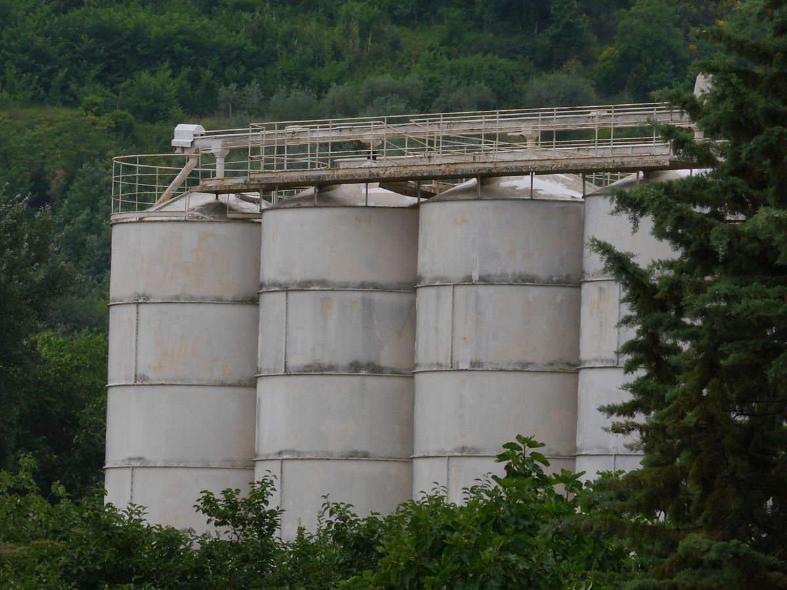
## Development and Operations: Separate Realms

Historically, Development and Operations teams operated in silos, each with distinct responsibilities and goals.

---

# Historical Divide: Development vs Operations

| Aspect| Development (Dev)                             | Operations (Ops)                                   |
|-------------------------|--------------------------------------------------|-------------------------------------------------------|
| Focus       | Writing & updating code                          | Managing infrastructure & ensuring service reliability |
| Challenges      | Ensuring code works across environments          | Handling unforeseen changes & mitigating disruptions   |
| Mindset             | "Let's release new features quickly!"            | "Change can introduce issues; caution is necessary."   |
| Metrics | Speed of feature releases, Code quality          | System uptime, Response time to incidents              |

---

## The Wall of Confusion

The lack of collaboration often resulted in a "Wall of Confusion," where software released by the Development team would encounter issues in the environments managed by the Operations team.

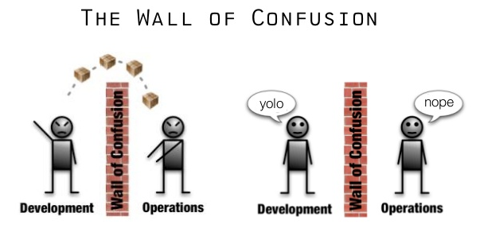

---

### Results of the Divide

- **Slower Releases:** Waiting for Operations to deploy.
- **Missed Deadlines:** Unforeseen issues leading to back-and-forth.
- **Blame Games:** Pointing fingers when things went wrong.
- **Decreased Productivity:** Duplication of effort and miscommunication.

---

### Bridging the Gap

The realization of these inefficiencies led to the rise of the DevOps movement, seeking to break down the silos and promote collaboration between Development and Operations.

---

# Introduction to SRE
> Site Reliability Engineering

---

# **SRE is what happens when you ask a software engineer to design an operations team**
*Benjamin Treynor Sloss*

---

# SRE Responsibilities

- Availability
- Latency
- Performance
- Efficiency

- Change Management
- Monitoring
- Emergency Response
- Capacity Planning

---

<!-- _footer: "" -->

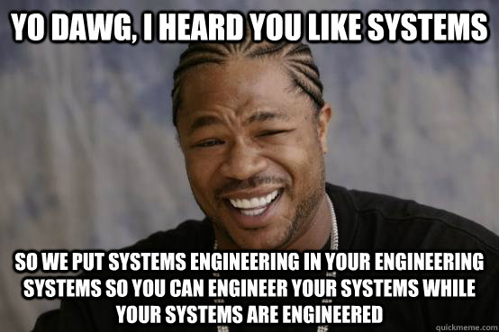

---

# <!-- fit --> Hope is not a strategy.
>Common SRE Saying

---

# Embracing Risk
   - Achieving high reliability is tough.
   - Learn from unexpected failures.
   - Always expect systems to have shortcomings.
   - SRE teams should proactively address risks.
   - Balance the costs and benefits of increased reliability.

---

<!-- _footer: "" -->

---

# Reliability

| Level       | Monthly Downtime | Annual Downtime | Cost  |
| ----------- | ---------------- | --------------- | ----- |
| **99.9%**   | 43.8m            | 8.75h           | $     |
| **99.95%**  | 21.9m            | 4.375h          | $$    |
| **99.99%**  | 4.38m            | 52.6m           | $$$   |
| **99.995%** | 2.19m            | 26.3m           | $$$$  |
| **99.999%** | 26s              | 5.25m           | $$$$$ |

>https://uptime.is/five-nines

---

# Service Level Objectives
| SLI | SLO | SLA |
|---|---|---|
| Service Level Indicator | Service Level Objective | Service Level Agreement |
| Metrics for service quality, e.g., error rate. | Targets, e.g., 99.9% uptime/month. | Contracts with set metrics and penalties. |
| Assess service quality. | Define service quality goals. | Formalize commitments and consequences. |

---

---

# Error Budgets

- A tool to balance reliability and rate of innovation.
- Allows for a predetermined level of acceptable unreliability.

---

<!-- _footer: "" -->

---

# Components of Error Budgets

| Component     | Description                 | Example                                     |
| ------------- | --------------------------- | ------------------------------------------- |
| **Objective** | Desired success level       | 99.95%                                      |
| **SLI**       | Evaluation of failed events | 95th percentile latency < 100ms over 5 mins |
| **Timeframe** | Recency bias for the SLI    | Previous 28 days                            |

---

# Constructing an Error Budget

> "99.95% of the 95th percentile latency of API requests over 5 mins is < 100ms over the previous 28 days."

**Error Budget** = 1 - *Objective*

For our example:

- Objective: 99.95% (or 0.9995)
- Error Budget: 0.05% (or 0.0005)

Over 28 days, this is:

> 20.16 minutes (.0005 * (28 * 24 * 60))

---

# When the Error Budget is Exhausted?

- **Halt**: 
  - No new features or deployments.
  - No changes or experiments.

- **Prioritize**:
  - Enhance reliability.
  - Minimize toil.
  - Bolster monitoring & automation.
  - Strengthen testing.

* **Improve reliability.**
* **Improve reliability.**

---

# Toil
- Manual work needed to maintain a service.
- SREs use automation to minimize toil.

---

## Examples of Toil

- Regularly restarting a failing service.
- Manually scaling services up/down based on traffic.
- Running repetitive database maintenance tasks.
- Hand-creating reports from logs.
- Daily cleanup of temporary files.
- Manually updating configuration files across servers.

---

# Managing Toil
- Identify time-consuming SRE tasks.
- Distinguish actual toil from manual tasks.
- Set clear guidelines.
- Build features that reduce toil and enhance reliability.

---

# Feedback Loops in SRE

- **Feedback Loops** ensure that systems are continuously improved based on results or feedback.
- They promote a culture of iterative refinement and rapid response.

## Why are they important?

- Identify areas of improvement quickly.
- Adjust strategies or methodologies based on outcomes.
- Foster better communication and understanding between teams.

---

# Monitoring Distributed Systems

## Why Monitor?
- Distributed systems span multiple locations, increasing complexity.
- Detect anomalies early to prevent bigger problems.
- Gain insights into system health and pinpoint areas for improvement.

---

# Core Monitoring Types

|                 | **Black-box**       | **White-box**          |
| --------------- | ------------------- | ---------------------- |
| **Focus**       | System Outputs      | System Internals       |
| **Reflection**  | User Experience     | Component Interactions |
| **Data Source** | External Tests      | Internal Metrics/Logs  |
| **Use Case**    | Availability Checks | Debugging & Profiling  |

---

## Tech Metrics Overview
| Metric | Definition | Purpose |
|---|---|---|
| MTBF | Mean Time Before Failure | Average time between failures. |
| MTTR | Mean Time To Recovery/Repair/Respond/Resolve | Time to recover from a failure. |
| MTTF | Mean Time To Failure | Expected time to the first failure. |
| MTTA | Mean Time To Acknowledge | Time to acknowledge an incident. |

---

# Effective Alerting
- Alert based on potential user impact.
- Notify when nearing an SLO breach.
- Make alerts clear and directly useful.

---

# Monitoring Distributed Systems
## Best Practices
- **Consistent Metrics**: Adopt uniform metrics throughout components for clarity.
- **Granular Monitoring**: Detailed observation, both system-wide and at the component level.
- **Postmortems**: Utilize monitoring data post-incident to derive insights and prevent recurrences.

---

# Monitoring Distributed Systems
## Visualization & Review
- **Dashboards**: Implement live visualization tools for real-time system status overviews.
- **Feedback Loops**: Continually refine monitoring based on feedback and new challenges.
- **Regular Reviews**: Periodically examine the system's monitoring setup for relevance and efficiency.

---

# Alerting & On-Call

- **Prioritize Alerts**  
   - High, medium, low severity levels.
   - Avoid alert fatigue with proper thresholds.
   
- **Ensure Alert Relevancy**  
   - Only trigger alerts for actionable events.
   - Refine and tune alerts regularly.

---

# On-Call Engineers
- **Rotation Schedules**  
   - Avoid burnout with shifts and breaks.
   - Implement regular handoffs for continuity.
   
- **Necessary Resources** 
   - Access to documentation and tools.
   - Clear escalation paths for critical issues.

---

# Troubleshooting & Emergency
- **Systematic Approach**  
   - Start from checking basic functionalities.
   - Use a top-down or bottom-up methodology.
   
- **Use Monitoring and Logging**  
   - Access to real-time data.
   - Historical logs for pattern analysis.

---

#  Handling System Emergencies and Outages
- **Establish Clear Communication Channels**  
   - Inform stakeholders promptly.
   - Regular status updates to teams and users.
   
- **Implement Quick Rollbacks**  
   - Have mechanisms to revert changes.
   - Backup systems to restore functionality.

---

# Incident Management
- **Incident Classification**  
   - Define what constitutes an incident.
   - Categorize by impact and urgency.
   
- **Assemble a Response Team**  
   - Cross-functional members for expertise.
   - Clear roles and responsibilities.

---

# Blameless Postmortems

- Understand incidents and prevent future ones.
- Focus on learning, not blaming.

## **Core Steps**:

- **Documentation**:  
   - Events timeline.
   - Taken actions.
   
- **Review Meeting**:  
   - Discuss outcomes.
   - Define action items.

## **Components**:

- **Timeline**: Sequence of events.
- **Impact Analysis**: Affected entities.
- **Root Cause**: Reason for incident.
- **Actions**: Preventative measures.

---

# Release Engineering

- Safe and efficient software updates deployment.
   - Key areas: Version control, CI/CD, rollout strategies, canary releases, and monitoring.

- **Impact**:  
   - Minimized downtime.
   - Faster deployments via automation.
   - Consistency and reduced issues.
   - Enhanced system reliability.

---

# Blast Radius of Change

- The "Blast Radius" refers to the potential impact of a change or failure.
- Understanding and managing the blast radius is crucial in minimizing disruptions.
- SREs focus on reducing the blast radius to ensure system stability and reliability.

---

# Feature Flags & Toggles

- **Feature Flags** (or Feature Toggles) are a technique that allows teams to modify system behavior without changing code.
  
## Benefits

- Enable/Disable features without deploying new code.
- Gradually roll out features to a subset of users.
- Easily roll back problematic features.
- Test in production, ensuring real-world performance.

---

# Canary Deployments

A release strategy involving gradual rollout to a small group before full deployment.

---

# Canary Deployments

"Canaries" are the initial users/servers to detect issues or bugs in the new release.

---

# Canary Deployments

Incremental deployment reduces the risk of widespread outages.

---

# Canary Deployments

Continuous monitoring and feedback gather performance insights.

---

# Blue Green Deployments

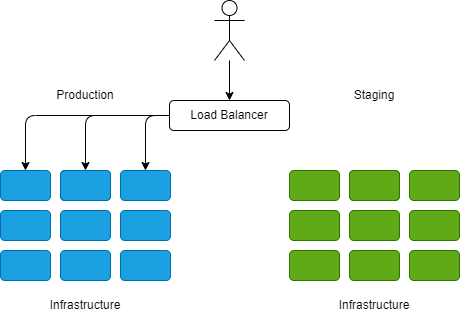

- Parallel Environments: Maintain Blue (production) and Green (updates).
- Zero Downtime: Switch between Blue and Green without downtime.
- Testing & Validation: Thoroughly validate updates in the Green environment.
- Instant Rollback: Quickly revert to the stable Blue environment if issues arise.

---

# Blue Green Deployments

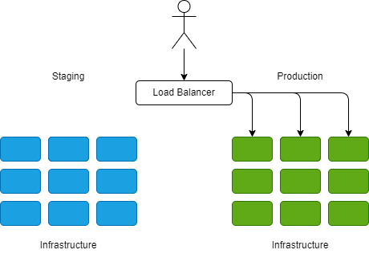

- Controlled Release: Gradually shift traffic from Blue to Green.
- Canary Testing: Test updates with a small portion of traffic in the Green environment.
- Traffic Cut-Over: Switch all traffic to Green after successful validation.
- Rollback Option: Instantly return to the stable Blue environment if needed.

---

# Dive into DevOps

DevOps, popularized by figures like **Patrick Debois** and **Andrew Shafer**, emphasizes collaboration between development and operations, focusing on *cultural shifts*, *automation*, and *feedback loops* for faster, reliable software releases.

---

 
 

# “DevOps is the union of people, process, and products to enable continuous delivery of value to our end users.”

## - Donovan Brown

 
 

---

## Cultural Shifts in DevOps

- **Collaboration Over Silos:** Breaking down the barriers between development and operations teams to work together seamlessly.
- **Blameless Culture:** Instead of pointing fingers, teams focus on learning from failures and continuously improving.
- **Empowerment and Ownership:** Every team member takes responsibility for the software's life cycle, from development to production.
- **Continuous Learning:** Regular retrospectives and a focus on iterative improvement.

---

# How we Work
- Agile
- Scrum
- Pair Programming
- Kanban
 
---

### Feedback Loops

- Incorporate real-time feedback throughout the development process.
- Iteratively refine based on results or feedback.
- Enables rapid adjustments and promotes continuous improvement.

---

### Collaborative Culture

- Foster open communication and collaboration across departments.
- Eliminate traditional silos between development and operations.
- Shared responsibilities ensure everyone is accountable for the end product.

---

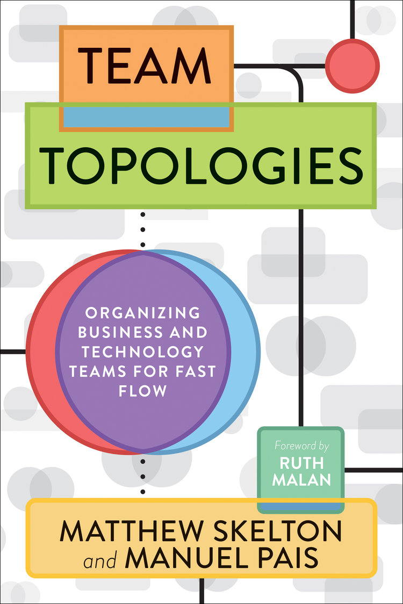

# Team Topologies

Understanding team structures and their interactions is crucial for efficient software delivery and system reliability. "Team Topologies" by Matthew Skelton and Manuel Pais offers insight into different team patterns for IT delivery.

---

## Four Core Team Patterns

1. **Stream-aligned Team:** Directly aligned to a flow of work from a segment of the business domain.
2. **Enabling Team:** Helps a stream-aligned team overcome obstacles.
3. **Complicated Subsystem Team:** Where mathematics/calculation is the main focus, separate from the main flow.
4. **Platform Team:** Offers services to other teams to accelerate delivery.

---

---
### Conway's Law

"Organizations which design systems ... are constrained to produce designs which are copies of the communication structures of these organizations."

**Key Takeaways:**
- The structure of your organization influences your system's design.
- Ensure good communication and collaboration for better systems.
- Consider organizational changes to drive desired software architecture.

---

# Shift Left
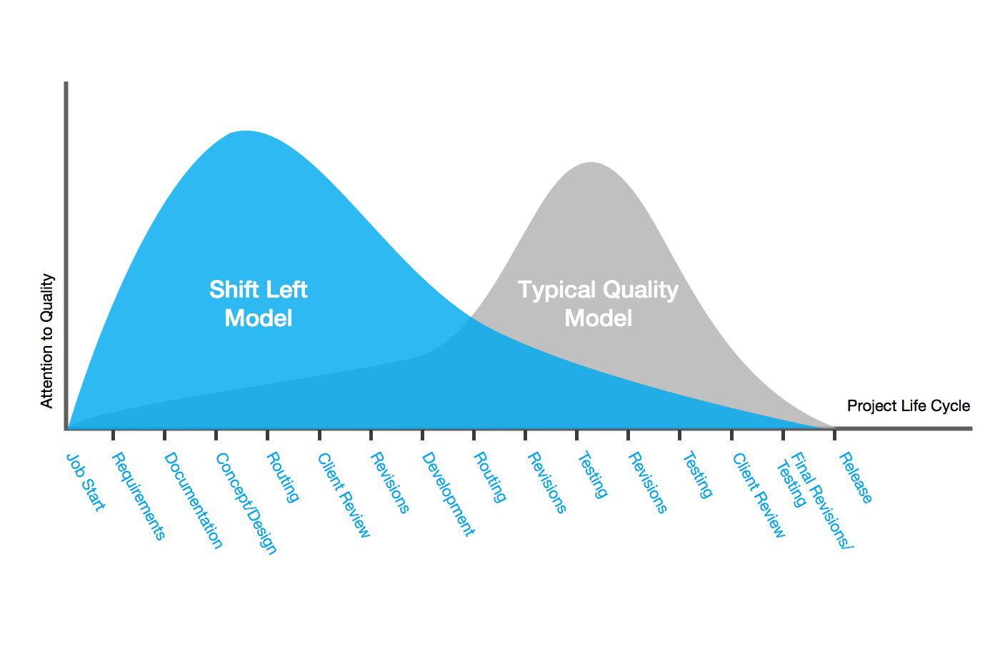

---

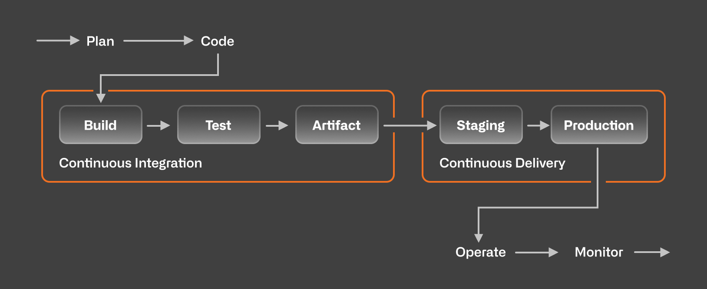

# CI/CD

**Continuous Integration & Continuous Deployment** streamline the software development lifecycle, ensuring that code changes are continuously integrated, tested, and delivered to production.

---

## Continuous Integration (CI)

- Automatically integrate and validate code changes.
- Run tests and security scans

## Continuous Deployment (CD)

- Automate deployment processes to various environments.
- Ensures production-ready releases.

---

## Benefits of CI/CD

- 🚀 **Faster Releases:** Reduced manual processes speed up software delivery.
- 🐞 **Improved Quality:** Early and frequent testing leads to fewer bugs.
- 🔁 **Rapid Feedback:** Immediate feedback on code changes for developers.
- 📈 **Increased Productivity:** Less time spent on manual tasks.

---

### Infrastructure as Code (IaC)

- Manage and provision infrastructure using code and automation.
- Ensures consistent and repeatable infrastructure deployments.
- Easily scale and replicate environments, reducing manual setup and errors.

---

## Why use Infrastructure as Code (IaC)?

The goal of IaC is to make it easier to deploy and manage infrastructure in a repeatable, reliable way, and to reduce the risk of errors caused by manual configuration.

---

# Configuration Management

Configuration Management ensures that system configurations remain consistent and optimized. It plays a pivotal role in modern DevOps practices by ensuring smooth deployments, scalability, and system reliability.

---

## What is Configuration Management?

- **Consistency:** Ensures every instance of the software runs the same way in every environment.
- **Automation:** Reduces manual intervention, making deployments faster and error-free.
- **Scalability:** Facilitates easy replication of configurations across multiple servers or instances.

---

## Why Configuration Management?

- **Version Control:** Track and control changes to maintain system stability.
- **Auditing & Compliance:** Easily verify and ensure system configurations meet required standards.
- **Faster Recovery:** In case of failures, quickly revert to a known good configuration.

---

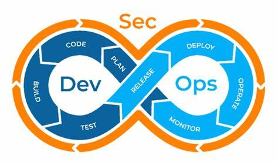

# DevSecOps: Security at Speed

Integrating security within the DevOps pipeline, DevSecOps ensures that security is considered at every phase of the software development lifecycle, rather than being tacked on at the end.

---

## What is DevSecOps?

- **Proactive Security:** Catching vulnerabilities early, when they're easiest and least expensive to fix.
- **Continuous Security:** Automated checks and validations throughout CI/CD pipelines.
- **Shared Responsibility:** Every team member, from developers to operations, plays a role in ensuring security.

---

## Benefits of DevSecOps

- **Reduced Risk:** Early detection of vulnerabilities leads to minimized exposure.
- **Faster Time-to-Market:** Automated security checks reduce the delays associated with traditional security audits.
- **Improved Compliance:** Regular checks ensure software always meets security standards and regulations.

---

## Implementing DevSecOps

- **Automated Scans:** Tools like Snyk or OWASP Dependency-Check for dependency scanning.
- **Infrastructure as Code Security:** Scanning templates for security best practices.
- **Training & Culture:** Encouraging developers and operations to adopt a security-first mindset.

---

### Microservices

- Design software as suites of independently deployable services.
- Enables faster development, testing, and scaling of individual components.

---

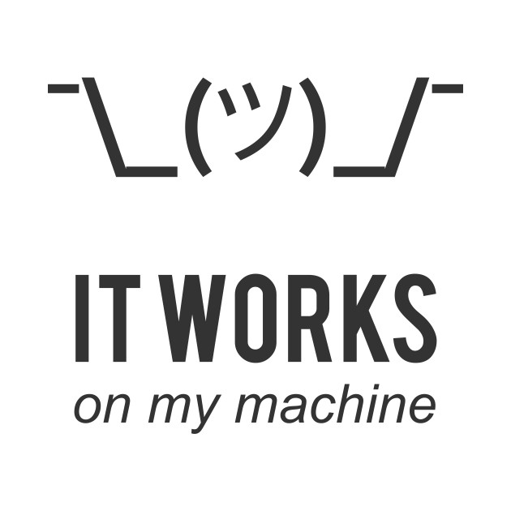

### Containers & Orchestration

- Lightweight, standalone executable software packages.
- Ensure consistency across environments and scalability.
- Tools like Docker for containerization and Kubernetes for orchestration.

---

### Monitoring & Logging

- Continuous observation of applications and infrastructure.
- Rapidly detect, address, and prevent issues.
- Provide insights into system health, usage, and potential bottlenecks.

---
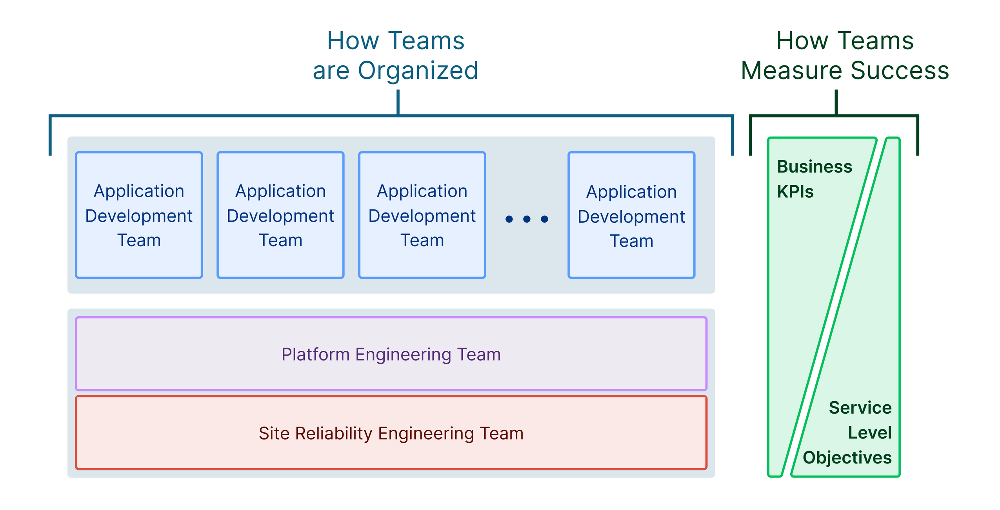

# Platform Engineering Deep Dive

---

## What is Platform Engineering?

Platform Engineering blends software development, infrastructure management, and best practices to offer scalable and efficient platforms for applications.

---

## Core Aspects of Platform Engineering

- Seamless software deployments
- Scalable infrastructure 
- Efficient integration of tools and services
- Accelerating the development lifecycle

*Building the bedrock for thriving applications.*

---

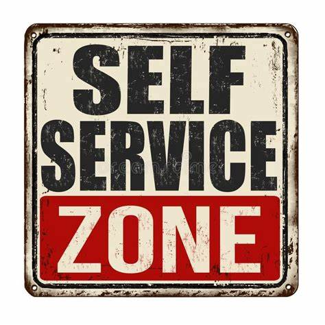

## The Power of Self-service Platforms

Equip developers with:
- Automated deployment workflows
- Click-to-provision infrastructure
- Integrated monitoring and logging
- Consistent deployment templates

---

## Abstracting Complexity

- Shield developers from underlying infrastructure complexities.
- Provide uniform deployment templates.
- Enable focus on high-quality code development.

*Achieve optimal workflows and heightened efficiency.*

---

### Gall's Law in Action

"Successful complex systems evolve from working simple systems. Complex systems designed from scratch fail. Begin with a functional simple system."

*Lessons Learned:*
- Prioritize iterative development.
- Sidestep initial over-complication.
- Champion simplicity for maintainability and growth.

---

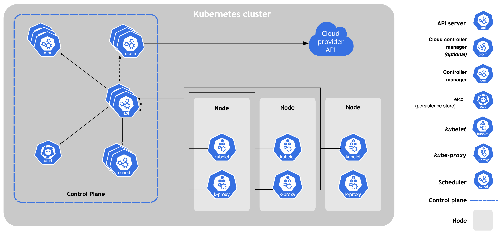

## Embracing Microservices & Containers

**Advantages:**
- **Flexibility:** Decompose apps into smaller units.
- **Scalability:** Independently scale components.
- **Portability:** Consistent environments through containers.

---

## Considerations for Scaling & Performance

- Adjust resources dynamically as demand spikes.
- Utilize load balancing for optimal traffic distribution.
- Monitor continuously to glean performance insights.

*Guarantee consistent system responsiveness.*

---

## Platform Engineering's Value Proposition

- **Optimal Developer Experience**
- **Faster Development:** Focus on code, not infra hitches.
- **Uniformity:** Unified tools and environments.
- **Resilience:** Maximized availability.
- **Future-proof:** Adaptable designs.

---

## Challenges in Modern Workflows

- **Legacy Ticketing Systems:** Lags due to extended ticket resolutions.
- **Approval Hurdles:** 
  - Multiple security clearances.
  - Network setups.
  - Vague feedback loops.

---

## Improving the Developer Experience

- **Promote Self-service:** Grant developers greater autonomy.
- **Conceal Complex Infrastructure:** Simplify infra complexities.
- **Promote Microservices & Containers:** For flexibility and consistency.
- **Embrace Efficient Scaling:** Dynamic resources and balanced loads.

---

## SRE, DevOps, and Platform Engineering

Three pillars ensuring robust software delivery and operations. They prioritize:
- **Collaboration & Automation**
- **Continuous Enhancement**
- **End-to-End Ownership**

---

## Disentangling SRE, DevOps, and Platform Engineering

---

## Overlapping Disciplines

Though each has its unique aims, there’s a convergence:
- **Automation:** Central to all.
- **Improved Release Cycles:** Shared goal of SRE and DevOps.
- **Tool Provisioning:** Platform Engineering's forte.

---

## Concluding Thoughts

SRE ensures robustness, DevOps champions teamwork, and Platform Engineering provides indispensable tools. Together, they redefine software delivery.

---

# Questions

---

## Resources

#### GitHub Repo
#### https://github.com/codebytes/sre-devops-platform-eng
#### Blog
#### https://chris-ayers.com

## Contact

<i class="fa-brands fa-bluesky"></i> BlueSky: [@chris-ayers.com](https://bsky.app/profile/chris-ayers.com)
<i class="fa-brands fa-linkedin"></i> LinkedIn: - [chris\-l\-ayers](https://linkedin.com/in/chris-l-ayers/)
<i class="fa fa-window-maximize"></i> Blog: [https://chris-ayers\.com/](https://chris-ayers.com/)
<i class="fa-brands fa-github"></i> GitHub: [Codebytes](https://github.com/codebytes)
<i class="fa-brands fa-mastodon"></i> Mastodon: @Chrisayers@hachyderm.io
~~<i class="fa-brands fa-twitter"></i> Twitter: @Chris_L_Ayers~~

