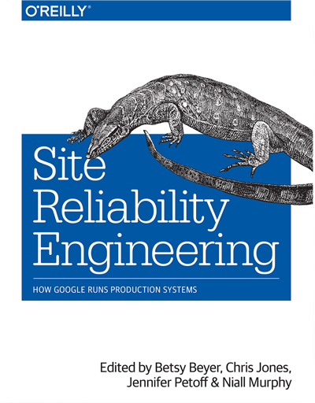
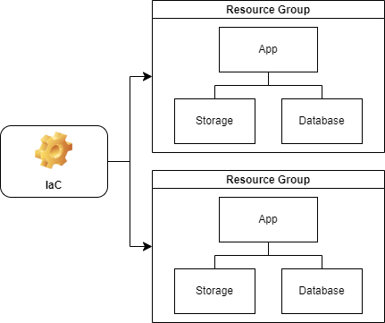
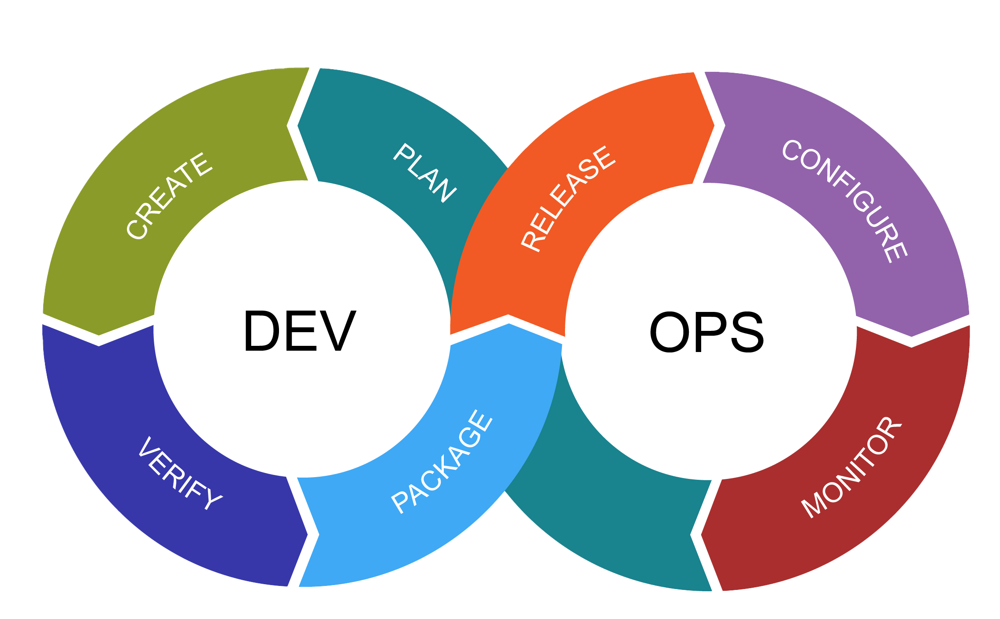

<!-- _footer: 'https://github.com/Codebytes/sre-devops-platform-eng' -->

### Chris Ayers 

---

## Chris Ayers
### Senior Customer Engineer Microsoft

<i class="fa-brands fa-twitter"></i> Twitter: @Chris\_L\_Ayers
<i class="fa-brands fa-mastodon"></i> Mastodon: @Chrisayers@hachyderm.io
<i class="fa-brands fa-linkedin"></i> LinkedIn: [chris-l-ayers](https://linkedin.com/in/chris-l-ayers/)
<i class="fa fa-window-maximize"></i> Blog: [https://chris-ayers.com/](https://chris-ayers.com/)
<i class="fa-brands fa-github"></i> GitHub: [Codebytes](https://github.com/codebytes)

---

# Agenda

- Introduction to SRE
- Dive into DevOps
- Exploring Platform Engineering

---

# Introduction to SRE

---

**Site Reliability Engineering (SRE)**

**Origin:** The term originated at Google when they sought to improve the reliability of their services and decided to apply principles of software engineering to operations.

**Key Features:**
- **SLIs, SLOs, and SLAs:** These metrics help in quantifying and measuring reliability.
- **Error Budgets:** A balance between release velocity and system reliability.
- **Automated Operations:** Reduce manual toil through automation.

**Objective:** Ensure services are reliable and available while also allowing for innovation and faster releases.

---

## Site Reliability Engineering (SRE)

**Software Engineering meets Systems Administration** 
SRE originated at Google in 2003 under the leadership of Ben Treynor Sloss. Recognizing the challenges of separating development and operations, he introduced software engineering principles to operations tasks. This innovative approach led to the creation of the "site reliability engineer" role, blending the expertise of developers and operators.

---

## Principles of SRE

- **Embracing Risk**: Understanding and managing risks in systems.
- **Service Level Objectives**: Setting and measuring reliability targets.
- **Eliminating Toil**: Reducing manual, repetitive tasks.
- **Monitoring Distributed Systems**: Techniques for effective monitoring.
- **Evolution of Automation at Google**: The journey of automation at Google.
- **Release Engineering**: Ensuring safe and efficient software releases.
- **Simplicity**: The importance of keeping systems simple and manageable.

---

# Practices 

**Practical Alerting**: Effective alerting strategies.
**Being On-Call**: Responsibilities and best practices for on-call engineers.
**Effective Troubleshooting**: Techniques for diagnosing issues.
**Emergency Response**: Handling emergencies and outages.
**Managing Incidents**: Incident management best practices.
**Postmortem Culture**: Learning from failures and mistakes.
**Tracking Outages**: Keeping a record of system outages.
**Testing for Reliability**: Ensuring system reliability through testing.

---

# Practices 

**Software Engineering in SRE**: The role of software engineering in SRE.
**Load Balancing**: Techniques for distributing traffic.
**Handling Overload**: Managing system overloads.
**Addressing Cascading Failures**: Preventing failures from affecting multiple systems.
**Managing Critical State**: Ensuring data consistency and reliability.
**Data Processing Pipelines**: Managing data flow and processing.
**Data Integrity**: Ensuring data accuracy and consistency.
**Reliable Product Launches**: Ensuring successful product launches.

---

| SLI | SLO | SLA |
|---|---|---|
| Service Level Indicator | Service Level Objective | Service Level Agreement |
| Metrics that provide a quantitative measure of the level of service. | A target level or range of performance for the SLI over a period of time. | A formal, often contractual agreement between a service provider and its users that defines the expected performance and availability metrics, as well as penalties for not meeting them. |

---

# Error Budgets

---

## Components of Error Budgets

1. **Objective:** The desired success level, typically a percentage.
    - **Example:** 99.95%
2. **SLI (Service Level Indicator):** An evaluation used to differentiate the number of failed events.
    - **Example:** 95th percentile latency of API requests over 5 mins is < 100ms.
3. **Timeframe:** Introducing a recency bias to the SLI.
    - **Example:** Previous 28 days.

---

## Constructing an SLO

Given the example components, the SLO can be expressed as:

> "99.95% of the 95th percentile latency of API requests over 5 mins is < 100ms over the previous 28 days."

---

## Calculating the Error Budget

The Error Budget is derived from:
> Error Budget = 1 - Objective of the SLO

**Example Calculation:**
(1 - .9995 = .0005) or 0.05%

Given a 28-day timeframe, this translates to an error "budget" of:
> 20.16 minutes (.0005 * (28 * 24 * 60))

---

# Infrastructure as Code (IaC)

Infrastructure as code (IaC) is a way to manage and provision infrastructure resources using configuration files and automation tools. 

---

## IaC in SRE & DevOps: Key Benefits

1. **Automation & Consistency:** IaC automates provisioning, ensuring consistent infrastructure across environments.
2. **Version Control:** Infrastructure, like software code, can be versioned, allowing for easy rollbacks and history tracking.

---

## IaC in SRE & DevOps: Scalability & Collaboration

1. **Scalability:** With IaC, scaling infrastructure is as simple as adjusting parameters, facilitating easy growth.
2. **Collaboration:** Teams can review infrastructure changes like software code, fostering collaboration and preventing errors.

In SRE and DevOps, the drive is to minimize manual work and increase repeatability and reliability. IaC stands as a foundational component for these goals.

---

## Monitoring & Automation in SRE

- Techniques for effective **monitoring** of distributed systems.
- The importance of **automation** in operations.

---

## Release & Simplicity in SRE

- Ensuring safe and efficient **software releases**.
- Importance of keeping systems **simple** and manageable.

---

## Management in SRE

- Training and **onboarding** SREs.
- **Communication** and collaboration in SRE.
- Adapting and evolving **SRE practices**.

---

## Conclusions

- Insights from other sectors.
- Final thoughts and takeaways on SRE.

---

# Dive into DevOps

---

DevOps promotes collaboration between development and operations teams through a set of practices and cultural philosophies.

---

 
 

# “DevOps is the union of people, process, and products to enable continuous delivery of value to our end users.”

## - Donovan Brown

 
 

---

## Key Concepts of DevOps

- **CI/CD:** Automatic build, test, and deploy processes.

---

- **Infrastructure as Code:** Automation of infrastructure tasks.

---

- **Feedback Loops:** Quick detection and resolution of issues.

---

- **Collaborative Culture:** Breaking silos and shared responsibilities.

---

# Exploring Platform Engineering

Platform Engineering is the nexus of software development, infrastructure management, and best practices, centered on providing robust, scalable, and efficient platforms for applications and services.

---

## Defining Platform Engineering

Platform Engineering facilitates:
- Streamlined software deployments
- Infrastructure scalability
- Seamless integration between tools and services
- Accelerated development processes

It's about laying the foundation upon which applications thrive.

---

## Key Concepts of Platform Engineering

---

### Self-service Platforms

Empowering developers with:
- Automated deployment pipelines
- Infrastructure provisioning with a click
- Monitoring and logging integrations

The aim? Minimize manual intervention and speed up the development lifecycle.

---

### Abstract Complexity

What does this mean?
- Hide intricate infrastructure details from developers.
- Provide standardized templates for deployment.
- Ensure developers focus on code, not infra setup.

Simplified processes, maximized efficiency.

---

### Microservices & Containers

Why are they crucial?
- **Flexibility:** Break applications into smaller, manageable units.
- **Scalability:** Scale components independently as needed.
- **Portability:** Containers ensure consistent environments across stages.

Tools like Kubernetes orchestrate these containers, ensuring reliability and scalability.

---

### Scaling & Performance

As demand grows:
- Dynamically allocate resources.
- Load balance to distribute traffic.
- Monitor in real-time for performance insights.

Optimizing resources ensures the system remains responsive even under peak loads.

---

## Why is Platform Engineering Vital?

1. **Developer Experience**
1. **Accelerated Development:** Less time grappling with infrastructure means more time coding.
1. **Consistency:** Same tools, processes, and environments across teams.
1. **Reliability:** Best practices ensure high availability and minimal downtime.
1. **Future-proofing:** Designed with growth and change in mind.

---

## Challenges in Enterprise Workflow

- **Ticketing Systems:** Delays due to lengthy "ServiceNow" ticket resolutions.
  
- **Approval Bottlenecks:** 
  - Security signoffs
  - Network configurations
  - Multiple rejections without clear feedback
  - Ambiguous task descriptions leading to incorrect implementations

---

# Enhancing Developer Experience

- **Self-service:** Automated processes for greater developer autonomy.
- **Simplified Infrastructure:** Shielding developers from complex infrastructure details.
- **Microservices & Containers:** Ensuring application flexibility, scalability, and consistent environments.
- **Efficient Scaling:** Dynamic resource allocation and optimized load balancing.
- **Holistic Experience:** Faster development cycles, uniformity across tools, reliable systems

---

## Conclusion

Platform Engineering is more than just tools and processes. It's an ethos that prioritizes efficiency, reliability, and scalability, ensuring applications and services are always at their best.

---

## Conclusion

---

SRE, DevOps, and Platform Engineering intersect at ensuring efficient and reliable software delivery and operation.

---

**Key Takeaways**

- **Collaboration & Automation:** Central to all disciplines.
- **Continuous Improvement:** Better processes and tools.
- **End-to-end Responsibility:** From code to operation.

---

**SRE, DevOps, and Platform Engineering: Disentangling the Trio**

---

**Introduction**

In the ever-evolving landscape of software engineering, terms like SRE, DevOps, and Platform Engineering have become increasingly popular. But what do they mean, and how do they differ? Let’s delve into these disciplines and shed light on their distinctions.

---

**DevOps**

**Origin:** Coined from merging ‘Development’ and ‘Operations’, DevOps is a cultural shift that promotes collaboration between these two traditionally siloed teams.

**Key Features:**
- **CI/CD:** Continuous Integration and Continuous Deployment allow for quick code integrations and releases.
- **Infrastructure as Code (IaC):** Automation of infrastructure tasks.
- **Feedback Loops:** Quick detection and resolution of issues.

**Objective:** Streamline the process from code development to deployment, ensuring faster release cycles and better product quality.

---

**Platform Engineering**

**Origin:** As companies scaled and sought to manage their infrastructure more efficiently, the discipline of platform engineering emerged.

**Key Features:**
- **Self-service Platforms:** Tools that allow developers to deploy, manage, and scale applications.
- **Abstract Complexity:** Providing simpler interfaces to developers by hiding underlying complexities.
- **Containerization and Orchestration:** Use of containers for application deployment and orchestration tools like Kubernetes to manage them.

**Objective:** Create robust platforms that allow for scalable, efficient deployment and management of applications and services.

---

**SRE vs. DevOps vs. Platform Engineering: The Overlap**

While the three disciplines have distinct objectives, there is a significant overlap. For instance, automation is a common theme across all three. SRE and DevOps both focus on improving the release cycle, while Platform Engineering provides the tools to achieve this. 

---

**Conclusion**

In essence, SRE, DevOps, and Platform Engineering are disciplines that, while distinct, work hand-in-hand. SRE ensures reliability, DevOps promotes collaboration and streamlining, and Platform Engineering provides the tools and platforms necessary to achieve both. Understanding their nuances allows for better implementation and synergy among teams.

